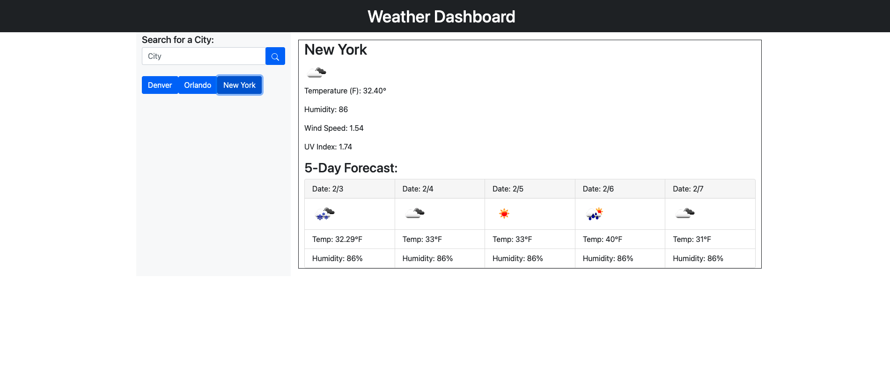

# Weather-Dashboard

Live URL: https://mfranl.github.io/should_i_bring_a_jacket/

This weather app displays temperature, humidity, wind speed, and the UV index for the current day whenever a user searches for a city. A 5 day forecast will also appear. The searches are save in local storage, and new searched will appear as buttons that you can revisit.

To improve I would edit my UV index to make the color change based on dangerous levels(red) or normal levels (green).
